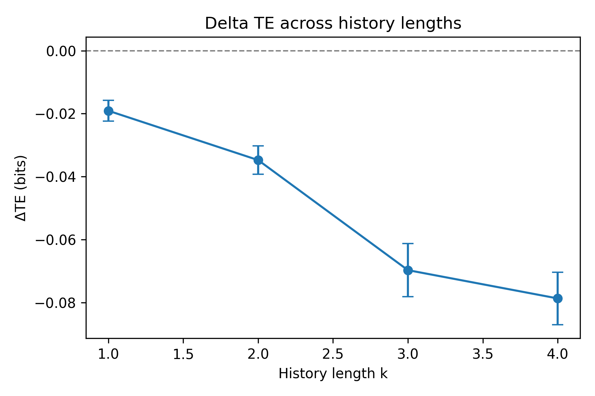
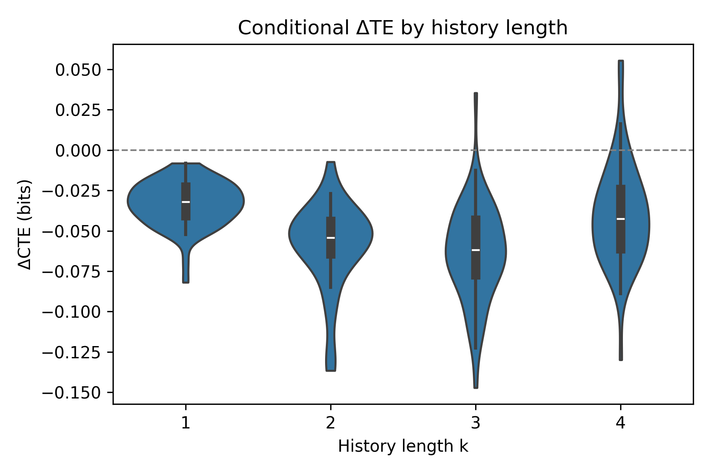

# ExtraSensory Dataset: Transfer Entropy Analysis of Activity and Sitting States

## Overview

This project reproduces and extends transfer-entropy (TE) analyses on the ExtraSensory mobile-sensing dataset to quantify the directional information flow between activity intensity (A) and sitting state (S). Building on the hypothesis that posture constrains motion more than the reverse, we find strong evidence that information flows predominantly from S→A across 60 participants, both in unconditional and hour-of-day–conditioned settings.

Key highlight: at k = 4 and τ = 1 minute, the median ΔTE = TE(A→S) − TE(S→A) is **−0.077 bits** (Wilcoxon W = 1.0, p = 1.7×10⁻¹¹), and the conditional variant ΔCTE = **−0.042 bits** (W = 90.0, p = 1.3×10⁻⁹), confirming S→A dominance.

## Methodology

- **Information Measures**: Discrete TE and Conditional TE (CTE) estimated with JIDT via JPype. Significance assessed with 1,000 circular-shift surrogates (seed = 1729).
- **Variables**  
  - **Activity (A)**: Minute-level accelerometer magnitude mean → per-user z-score → user-specific quintile binning (levels 0–4).  
  - **Sitting (S)**: Minute-level `label:SITTING` (0/1) after taking the modal value within each minute.  
  - **Hour bins (H_bin)**: 6 four-hour blocks chosen to guarantee ≥200 usable samples per bin on average.  
- **Timebase**: 1-minute grid; TE computed for τ = 1 (source at time t predicting destination at t+1).
- **Histories**: Robustness sweep over k = l ∈ {1, 2, 3, 4}; main inference at k = 4.
- **Differences from Original Proposal**  
  - Set `MAX_K_AIS = 4` to bound computation (proposal allowed larger search).  
  - Fixed conditioning variable to 6 bins (instead of 24) for numerical stability.  
  - Simplified CTE implementation to single conditioning variable (hour-of-day bins).

## Project Structure

```
extrasensory_analysis/
├── data/
│   ├── ExtraSensory.per_uuid_features_labels/    # Raw per-user CSVs
│   └── intermediate/                             # Large derived datasets (mvp_dataset.csv, etc.)
├── docs/
│   ├── Proposal/                                 # Original proposal materials
│   ├── specs/                                    # Planning & requirement documents
│   └── Proposal_WeixuanKong.pdf
├── jidt/
│   ├── infodynamics.jar                          # JIDT Java archive
│   └── infodynamics-dist-1.6.1/                  # Upstream distribution (docs, demos)
├── results/
│   ├── extrasensory_te_results.csv               # Aggregated per-user metrics (k selected per AIS)
│   └── final_analysis_outputs/
│       ├── group_stats.md                        # k = 4 Wilcoxon summaries & robustness checks
│       ├── stat_summary.csv                      # Descriptive stats regenerated post-refactor
│       ├── fig_deltaTE_by_k.png, fig_deltaCTE_violin.png, ...  # Visualizations
│       └── run_info.yaml                         # Provenance metadata (versions, seeds)
├── src/
│   ├── settings.py                               # Paths & global parameters (e.g., NUM_SURROGATES)
│   ├── preprocessing.py                          # Data loading, z-scoring, discretization
│   ├── analysis.py                               # AIS, TE, CTE implementations + surrogate tests
│   ├── main.py                                   # Orchestrates full per-user pipeline
│   └── smoke_test.py                             # Quick runtime validation script
├── archive/                                      # Legacy scripts and logs retained for reference
├── report.ipynb                                  # Interactive results and figures
├── requirements.txt                              # Python dependency lock
└── README.md
```

## Setup Instructions

1. **Python Environment**
   ```bash
   python -m venv .venv
   .\.venv\Scripts\activate  # Windows
   pip install -r requirements.txt
   ```
   The requirements file pins the dependency versions verified with Python 3.12 and JIDT; using these exact versions maximizes reproducibility.
2. **Dataset Placement**
   - Download each `*.features_labels.csv` from the ExtraSensory release (60 participants).
   - Place them under `data/ExtraSensory.per_uuid_features_labels/`.
   - Optional large intermediates (e.g., `mvp_dataset.csv`) reside in `data/intermediate/`.
3. **JIDT Installation**
   - Copy `infodynamics.jar` into `jidt/` (already provided in this workspace).
   - If replacing, update the path in `src/settings.py` (`JIDT_JAR_PATH = "jidt/infodynamics.jar"`).
4. **Java Runtime**
   - Ensure a Java Runtime Environment (JRE/JDK) is installed and discoverable (`java -version`).

## Usage

1. **Smoke Test (fast sanity check)**
   ```bash
   python -m src.smoke_test
   ```
   - Samples one participant, runs TE/CTE with two surrogates, and verifies JVM integration.

2. **Full Pipeline**
   ```bash
   python -m src.main
   ```
   - Iterates over all 60 participants, optimizes k via AIS, computes TE/CTE with 1,000 surrogates, and writes `results/extrasensory_te_results.csv`.

3. **Reproduction Script**
   ```bash
   python -m src.reproduce_te --data-root data/ExtraSensory.per_uuid_features_labels --out-dir results/final_analysis_outputs
   ```
   - Re-generates per-user TE/CTE sweeps (k = 1..4) alongside plots and metadata used in validation.

4. **Notebook Reporting**
   ```bash
   jupyter notebook report.ipynb
   ```
   - Provides exploratory visuals, statistical tests, and narrative interpretation ready for publication.

## Results

Pulling from `group_stats.md` (k = l = 4, τ = 1):

| Measure | Median (bits) | Hodges–Lehmann (bits) | Wilcoxon W | Two-sided p-value | BH-FDR |
|---------|---------------|-----------------------|-----------:|------------------:|-------:|
| ΔTE = TE(A→S) − TE(S→A) | **−0.077** | −0.078 | 1.0 | 1.7×10⁻¹¹ | 3.4×10⁻¹¹ |
| ΔCTE = CTE(A→S\|H) − CTE(S→A\|H) | **−0.042** | −0.041 | 90.0 | 1.3×10⁻⁹ | 1.3×10⁻⁹ |

- 98% of users show ΔTE < 0 at k = 4 (100% for k ≤ 3).  
- 93% of users show ΔCTE < 0 at k = 4, demonstrating robustness when conditioning on hour-of-day.  
- Descriptive summaries in `stat_summary.csv` confirm averages of TE/CTE remain stable after the refactor (e.g., mean TE(A→S) ≈ 0.0547 bits vs. TE(S→A) ≈ 0.1296 bits).





## Troubleshooting

| Issue | Possible Cause | Remedy |
|-------|----------------|--------|
| `Error starting JVM with jar path ...` | Incorrect `JIDT_JAR_PATH` or missing Java | Verify `jidt/infodynamics.jar` exists and `java -version` works; adjust `settings.py` if paths differ. |
| JVM `OutOfMemoryError` | Large surrogates and high k | Reduce `NUM_SURROGATES` or increase JVM heap (`JAVA_TOOL_OPTIONS=-Xmx8G`). |
| `Data file not found` warnings | Missing or misnamed per-user CSVs | Confirm filenames follow `<UUID>.features_labels.csv` and reside under `data/ExtraSensory.per_uuid_features_labels/`. |
| Smoke test fails quickly | Environment misconfiguration | Run `python -m src.smoke_test` to surface diagnostic logs; inspect logging output for the failing step. |

## License

This repository is licensed under the [MIT License](LICENSE).

## Citation

Please cite both the ExtraSensory dataset and this analysis if you build upon it:

- Vaizman, Y., Ellis, K., & Lanckriet, G. (2017). *ExtraSensory App: Data for User Modeling with Rich Mobile Sensors*.  
- Kong, W. (2024). *Transfer Entropy Analysis of Activity and Sitting States using ExtraSensory*. CSYS5030 Project, University of Sydney.

## Dataset Licensing & Attribution

The ExtraSensory dataset is released under the [Creative Commons Attribution 4.0 International (CC BY 4.0) license](https://creativecommons.org/licenses/by/4.0/). Redistribution of the raw data must preserve the license terms, and all derived works should provide proper attribution to the original authors (Vaizman et al., 2017) and link to the dataset page at <http://extrasensory.ucsd.edu>. When sharing this analysis publicly, do not include any data beyond what the CC BY 4.0 terms permit.
