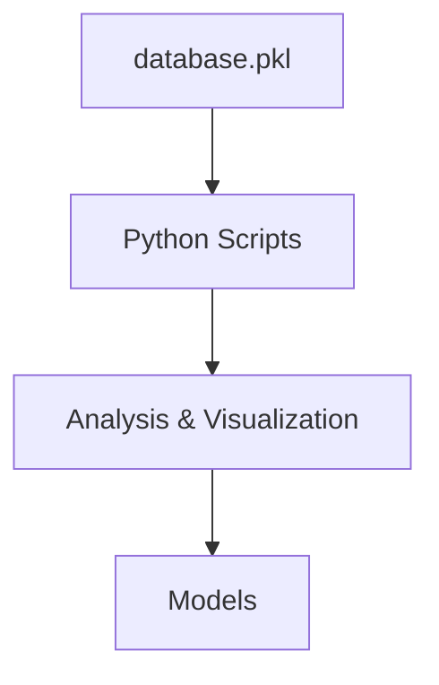
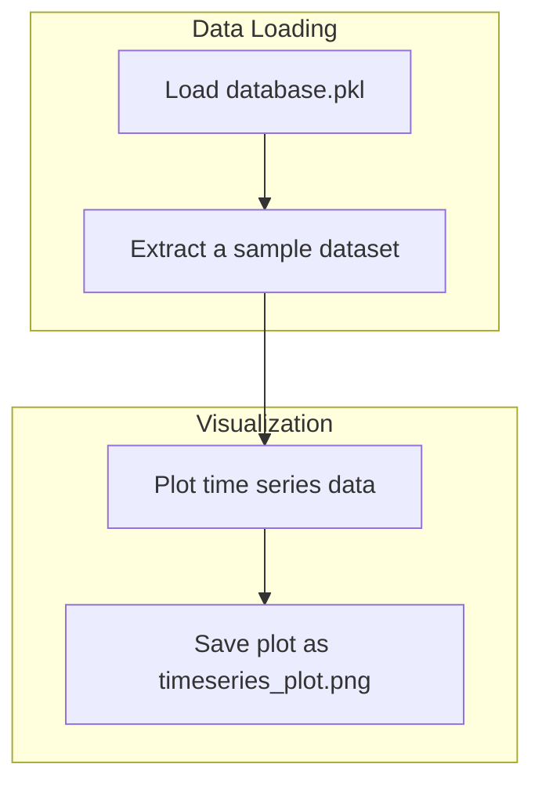

# PROJECT_DOCS.md

## 1. 项目概述 (Project Overview)
本项目旨在分析和处理一个包含1053个多变量时间序列的数据集。该数据集来源于LMTS，并存储在 `database.pkl` 文件中。

## 2. 项目结构 (Project Structure)

## 3. 核心组件与逻辑 (Core Components & Logic)
### 数据结构
- **`database.pkl`**: 包含一个Python字典。
- **顶层字典**: `{ 'dataset_name': <inner_dict> }`
- **内层字典**: `{{ 'data': <numpy.ndarray>, 'labels': <string> }}`

### 当前分析样本
- **数据集名称**: `spatiotemporal_intermittency_ii_alpha-1-75_epsilon-0-3_M10_T100`
- **数据形状 (变量数, 时间点数)**: `(10, 100)`
- **标签**: `['synthetic', 'chaotic', 'logistic map', 'symmetric', 'nonlinear', 'spatiotemporal_intermittency_ii']`

## 4. 交互与数据流 (Interaction & Data Flow)

## 5. 数据集普查分析 (Dataset Census Analysis)
对全部 **1053** 个数据集的名称进行了分析，以了解其来源和构成。

### 类别分布
| 主要类别 (Main Category) | 数据集数量 (Count) |
|---------------------------|--------------------|
| oscillator | 83 |
| LSST | 80 |
| vma | 68 |
| var | 67 |
| PEMS-SF | 57 |
| noise | 56 |
| Cricket | 44 |
| BasicMotions | 39 |
| HandMovementDirection | 39 |
| RacketSports | 38 |
| NATOPS | 37 |
| UCLA | 37 |
| kuramoto-sakaguchi | 27 |
| SelfRegulationSCP2 | 20 |
| FaceDetection | 20 |
| FingerMovements | 20 |
| SelfRegulationSCP1 | 19 |
| spatiotemporal | 18 |
| Heartbeat | 18 |
| hcp | 18 |
| EigenWorms | 15 |
| ArticularyWordRecognition | 14 |
| brownian | 14 |
| mousefMRI | 10 |
| epidemic | 10 |
| TestWEATHnoise | 10 |
| TestWEATHsub | 10 |
| TestWEATHmiss | 10 |
| TestWEATH | 10 |
| TestCLIMnonstat | 10 |
| TestCLIMnoise | 10 |
| TestCLIM | 10 |
| chaotic | 9 |
| defect | 9 |
| ForEx | 9 |
| wave-1D | 9 |
| ornstein-uhlenbeck | 9 |
| DJIA | 8 |
| SNP500 | 6 |
| wave-2D | 6 |
| vanderpol | 6 |
| pattern | 5 |
| traveling | 4 |
| wilson-cowan | 3 |
| 2021-06-17-mb49-pakistan | 1 |
| 2021-05-21-mww73-qinghai-china-5 | 1 |
| 1994-12-18-mw57-fiji-islands-region-5 | 1 |
| 2021-06-17-md32-puerto-rico-region | 1 |
| 2021-06-16-mb46-philippine-islands-region | 1 |
| 2021-06-17-mb46-lake-victoria-region | 1 |
| 2021-06-18-ml35-hawaii | 1 |
| 2021-06-18-ml32-texas-mexico-border-region | 1 |
| sim21 | 1 |
| sim19 | 1 |
| sim5 | 1 |
| sim28 | 1 |
| sim11 | 1 |
| sim9 | 1 |
| sim10 | 1 |
| sim15 | 1 |
| sim22 | 1 |
| sim2 | 1 |
| sim8 | 1 |
| sim6 | 1 |
| sim16 | 1 |
| sim26 | 1 |
| sim12 | 1 |
| sim14 | 1 |
| sim20 | 1 |
| sim13 | 1 |
| sim27 | 1 |
| sim18 | 1 |
| sim7 | 1 |
| sim17 | 1 |
| sim25 | 1 |
| sim1 | 1 |
### 初步结论
分析显示，该数据集主要由合成生成的数据（如 `lorenz`, `rossler`）和一些理论模型（如 `spatiotemporal_intermittency`）组成，而非来自真实世界的特定领域（如金融、医疗）。
