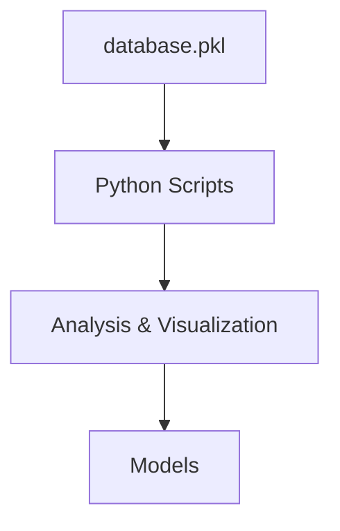
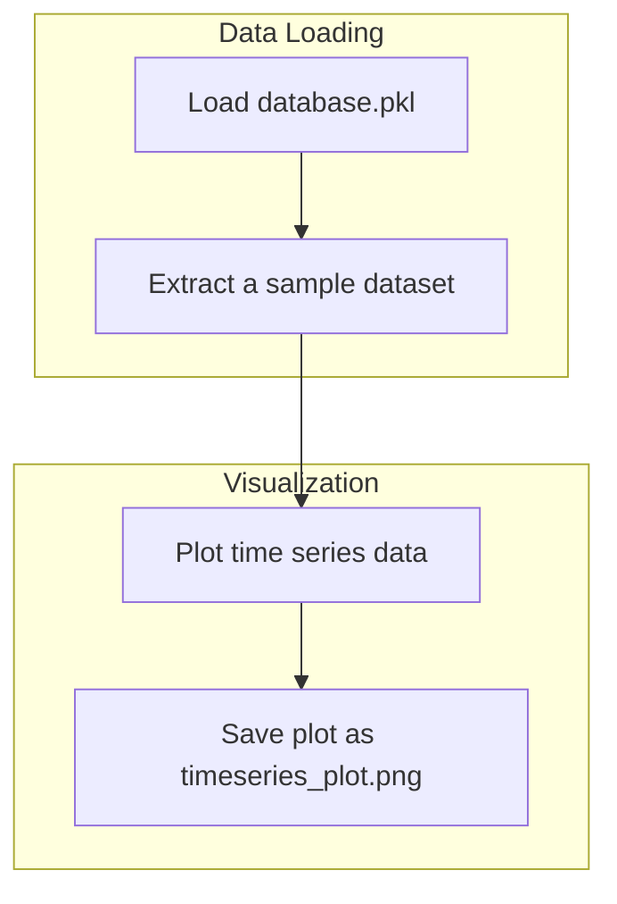

# PROJECT_DOCS.md

Archived notice: This document is not maintained and kept only for historical reference.

## 1. Project Overview
This archive describes an exploratory collection of 1053 multivariate time series. The index and samples were sourced from LMTS and stored in `database.pkl`.

## 2. Project Structure

```mermaid
graph TD
    A[database.pkl] --> B[Python Scripts];
    B --> C[Analysis & Visualization];
    C --> D[Models];
```

## 3. Core Components & Logic
### Data Structure
- `database.pkl`: Python dictionary.
- Top-level: `{ 'dataset_name': <inner_dict> }`
- Inner dict: `{ 'data': <numpy.ndarray>, 'labels': <string> }`

### Current Sample
- Dataset name: `spatiotemporal_intermittency_ii_alpha-1-75_epsilon-0-3_M10_T100`
- Shape (variables, time points): `(10, 100)`
- Labels: `['synthetic', 'chaotic', 'logistic map', 'symmetric', 'nonlinear', 'spatiotemporal_intermittency_ii']`

## 4. Interaction & Data Flow

```mermaid
graph TD
    subgraph Data Loading
        A[Load database.pkl] --> B[Extract a sample dataset];
    end
    subgraph Visualization
        B --> C[Plot time series data];
        C --> D[Save plot as timeseries_plot.png];
    end
```

## 5. Dataset Census Analysis
We analyzed names across all 1053 datasets to understand sources and composition.

### Category Distribution
| Main Category | Count |
|---------------------------|--------------------|
| oscillator | 83 |
| LSST | 80 |
| vma | 68 |
| var | 67 |
| PEMS-SF | 57 |
| noise | 56 |
| Cricket | 44 |
| BasicMotions | 39 |
| HandMovementDirection | 39 |
| RacketSports | 38 |
| NATOPS | 37 |
| UCLA | 37 |
| kuramoto-sakaguchi | 27 |
| SelfRegulationSCP2 | 20 |
| FaceDetection | 20 |
| FingerMovements | 20 |
| SelfRegulationSCP1 | 19 |
| spatiotemporal | 18 |
| Heartbeat | 18 |
| hcp | 18 |
| EigenWorms | 15 |
| ArticularyWordRecognition | 14 |
| brownian | 14 |
| mousefMRI | 10 |
| epidemic | 10 |
| TestWEATHnoise | 10 |
| TestWEATHsub | 10 |
| TestWEATHmiss | 10 |
| TestWEATH | 10 |
| TestCLIMnonstat | 10 |
| TestCLIMnoise | 10 |
| TestCLIM | 10 |
| chaotic | 9 |
| defect | 9 |
| ForEx | 9 |
| wave-1D | 9 |
| ornstein-uhlenbeck | 9 |
| DJIA | 8 |
| SNP500 | 6 |
| wave-2D | 6 |
| vanderpol | 6 |
| pattern | 5 |
| traveling | 4 |
| wilson-cowan | 3 |
| 2021-06-17-mb49-pakistan | 1 |
| 2021-05-21-mww73-qinghai-china-5 | 1 |
| 1994-12-18-mw57-fiji-islands-region-5 | 1 |
| 2021-06-17-md32-puerto-rico-region | 1 |
| 2021-06-16-mb46-philippine-islands-region | 1 |
| 2021-06-17-mb46-lake-victoria-region | 1 |
| 2021-06-18-ml35-hawaii | 1 |
| 2021-06-18-ml32-texas-mexico-border-region | 1 |
| sim21 | 1 |
| sim19 | 1 |
| sim5 | 1 |
| sim28 | 1 |
| sim11 | 1 |
| sim9 | 1 |
| sim10 | 1 |
| sim15 | 1 |
| sim22 | 1 |
| sim2 | 1 |
| sim8 | 1 |
| sim6 | 1 |
| sim16 | 1 |
| sim26 | 1 |
| sim12 | 1 |
| sim14 | 1 |
| sim20 | 1 |
| sim13 | 1 |
| sim27 | 1 |
| sim18 | 1 |
| sim7 | 1 |
| sim17 | 1 |
| sim25 | 1 |
| sim1 | 1 |

### Preliminary Conclusion
The collection is primarily synthetic (e.g., `lorenz`, `rossler`) and theoretical (e.g., `spatiotemporal_intermittency`), rather than domain-specific real-world datasets (e.g., finance, healthcare).
